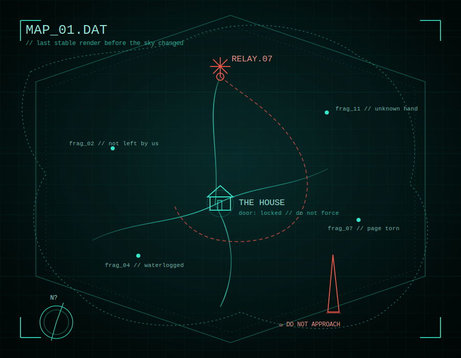

# ANOTHER SKY

*88.7 FM — if you can still find the frequency, you are not alone.*

---

> **TRANSMISSION LOG — SOURCE UNKNOWN**
>
> *You wake up before you remember falling asleep.*
> *The streetlights are on, but it isn't night.*
> *Someone has been in your apartment. They left the radio playing.*

---

You don't remember how you got here.

You remember a city — your city, maybe — with a sky the wrong shade of something, hanging low over rooftops that don't sit quite right anymore. You remember a signal, thin and half-drowned in static, repeating a frequency like it wants to be found. You remember a building in the distance that was not there yesterday, and will be closer tomorrow.

The people who are left don't talk about *before*. They talk about the sky — what color it was this morning, what shape the fog took, whether the rain fell black again last night. They keep notebooks. They keep quiet. They keep moving, because stopping too long in one place lets something catch up to you — something that was, once, a person.

There is a house that remembers you, even if you don't remember it. There is a locked room inside it that isn't ready to be opened yet. There is a voice on 88.7 that has been broadcasting long after every other station went dark, and it is not entirely clear who — or what — is still speaking.

Somewhere above all of it, the sky keeps changing. Watch it long enough and you'll start to understand: the sky isn't the backdrop.

**The sky is the warning.**

---

  

---

*Find the frequency. Follow the wrongness. Don't look up for too long.*

